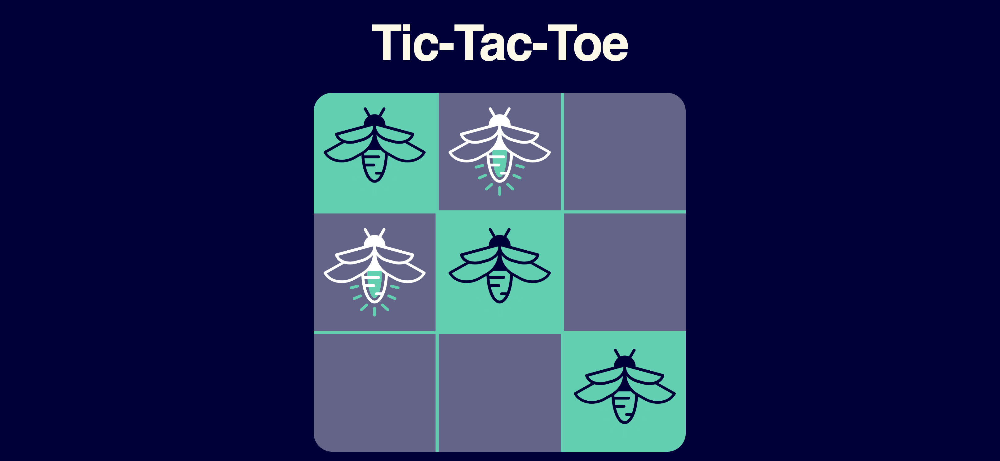

# Atlas Tic-Tac-Toe

This template provides a minimal setup to get React working in Vite with HMR and some ESLint rules.



## Project Requirements

- Create a two player tic-tac-toe game
- Players take turns placing tokens on the board
- Game end when a player has three in a row or all cells are filled

## Design Mockup

There is a static version of the app in the `mockup` folder. It is built with static HTML and CSS and can be viewed in any browser.

### Local Development

```bash
npm install
npm dev
```

### Deploy to GH Pages

Make sure you have created your own git repo with the name `atlas-tic-tac-toe` and pushed your code to it before trying to deploy.

```bash
npm run deploy
```

App will be avaiable at `https://<username>.github.io/<repo-name>`
